# 🏗️ Architecture Documentation

Comprehensive system architecture documentation for the Simulated Exchange Platform, including component diagrams, data flow, and design decisions.

## 📋 Table of Contents

- [System Overview](#system-overview)
- [High-Level Architecture](#high-level-architecture)
- [Component Architecture](#component-architecture)
- [Data Flow](#data-flow)
- [Demo System Architecture](#demo-system-architecture)
- [Deployment Architecture](#deployment-architecture)
- [Design Patterns](#design-patterns)
- [Performance Architecture](#performance-architecture)
- [Security Architecture](#security-architecture)

## 🔍 System Overview

The Simulated Exchange Platform is a cloud-native, high-performance trading system designed for demonstration, testing, and performance analysis. It follows microservices patterns with strong separation of concerns and comprehensive observability.

### Key Architectural Principles

- **SOLID Design Principles**: Single responsibility, open/closed, interface segregation
- **Dependency Injection**: Comprehensive DI container for loose coupling
- **Event-Driven Architecture**: Real-time updates via WebSocket streams
- **Hexagonal Architecture**: Clean separation of business logic and infrastructure
- **Observability First**: Built-in metrics, logging, and health monitoring

## 🏛️ High-Level Architecture

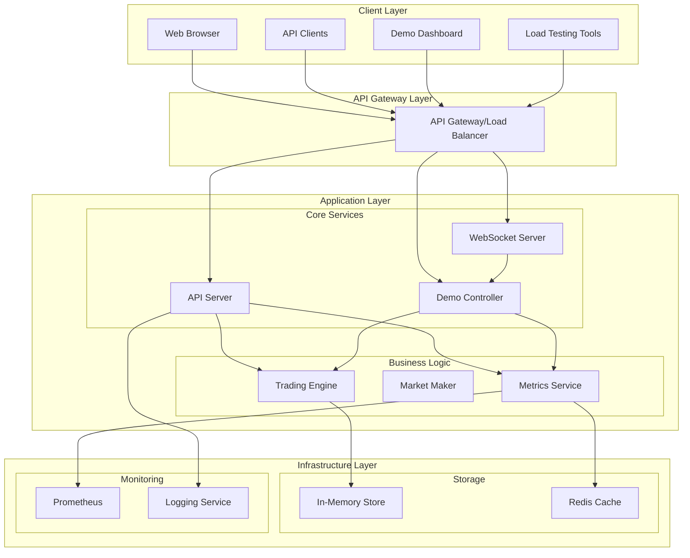

## 🔧 Component Architecture

### Core Components

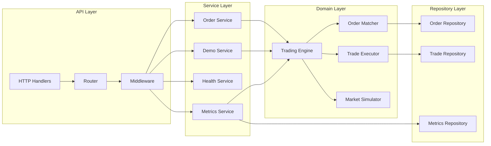

### Dependency Injection Container

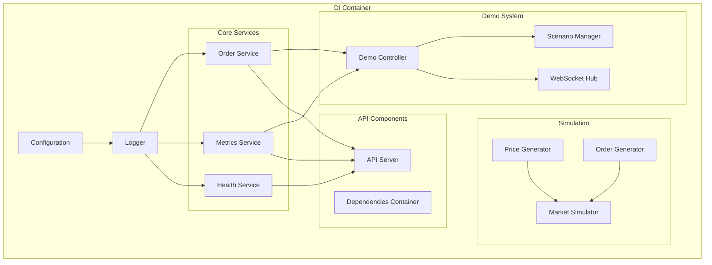

## 🌊 Data Flow

### Order Processing Flow

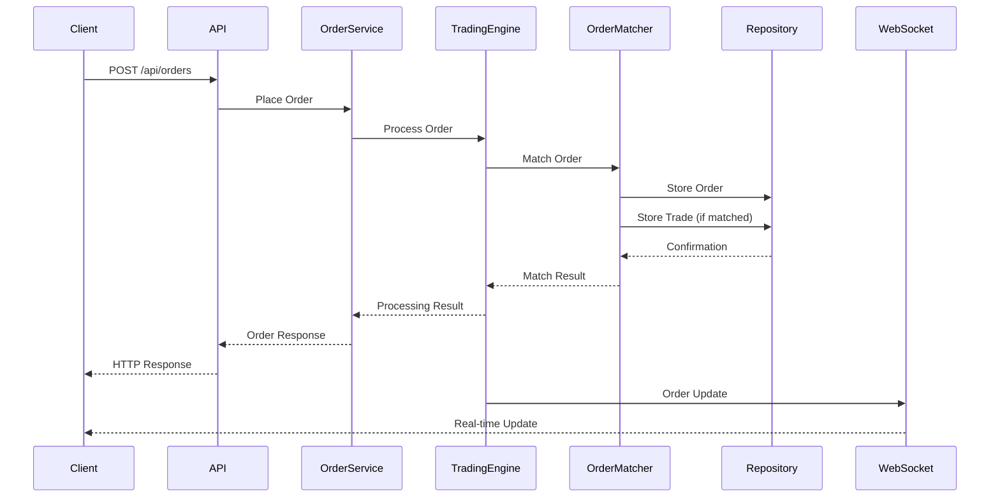

### Demo System Flow

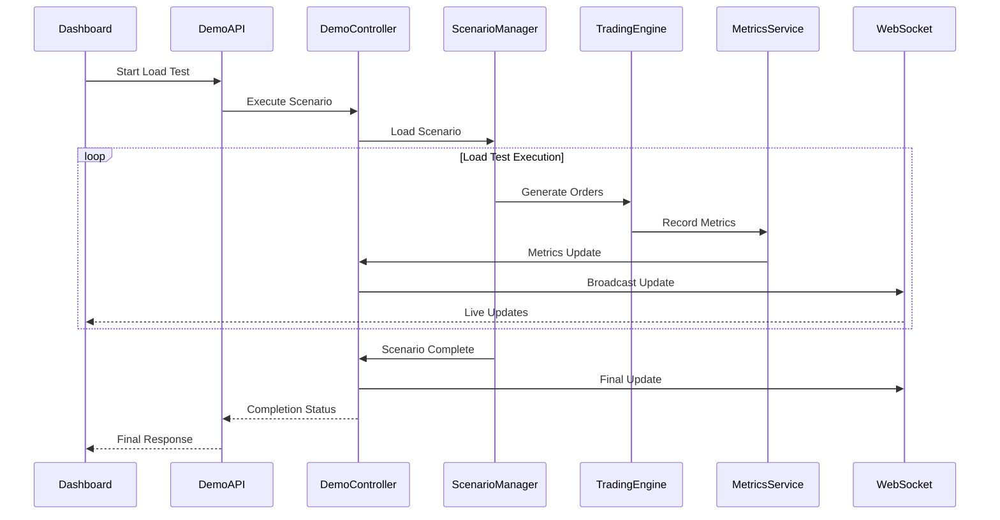

### Metrics Collection Flow

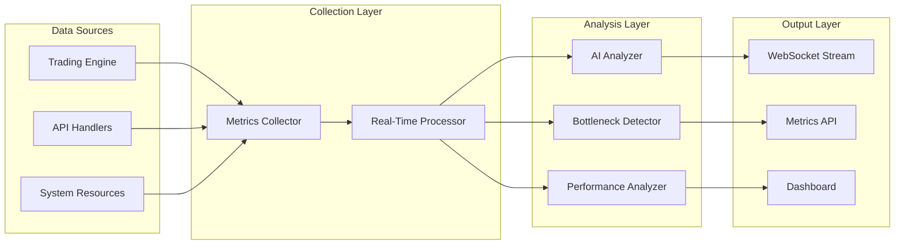

## 🎭 Demo System Architecture

### Demo Components

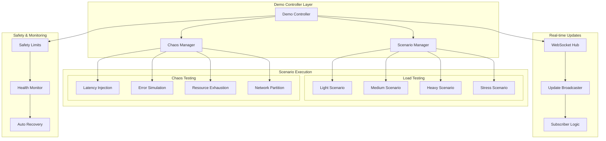

### WebSocket Architecture

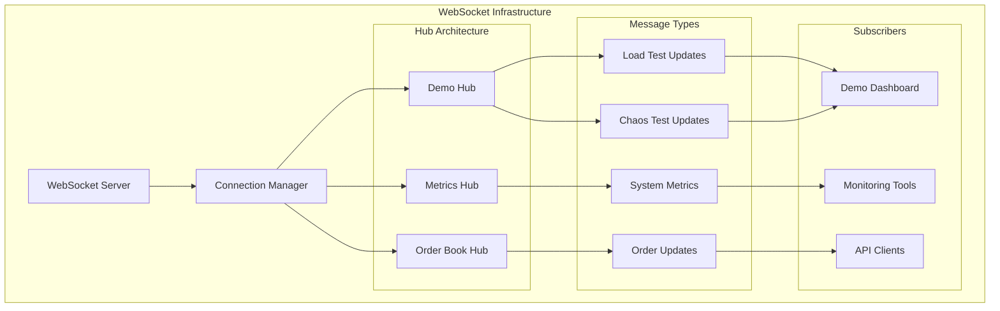

## 🚀 Deployment Architecture

### Container Architecture

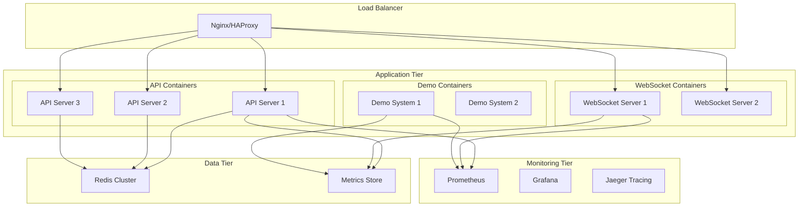

### Kubernetes Deployment

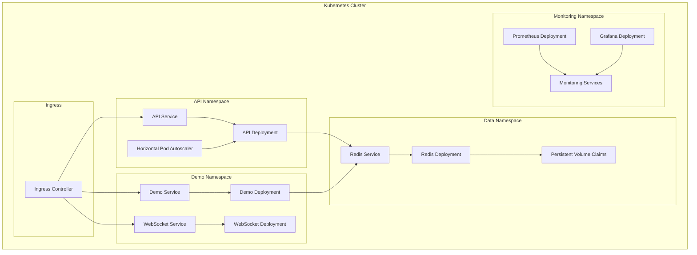

## 🎨 Design Patterns

### Repository Pattern

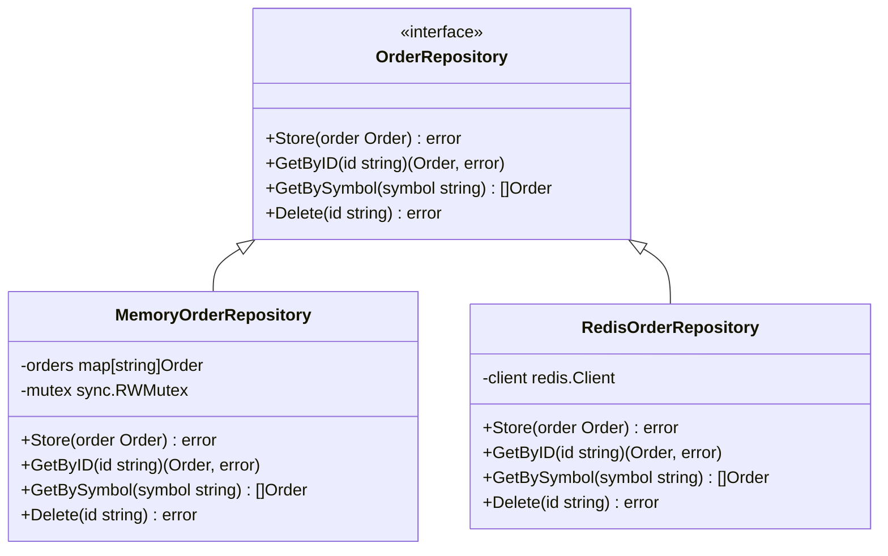

### Strategy Pattern (Demo Scenarios)

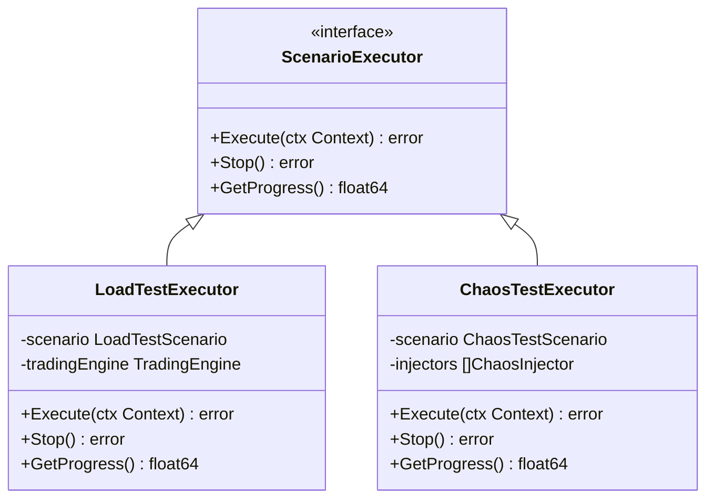

### Observer Pattern (WebSocket Updates)

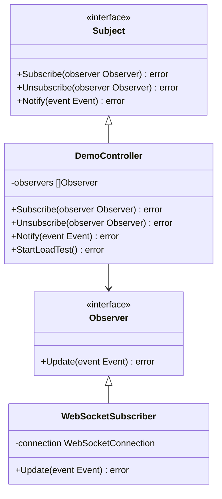

## ⚡ Performance Architecture

### Concurrency Model

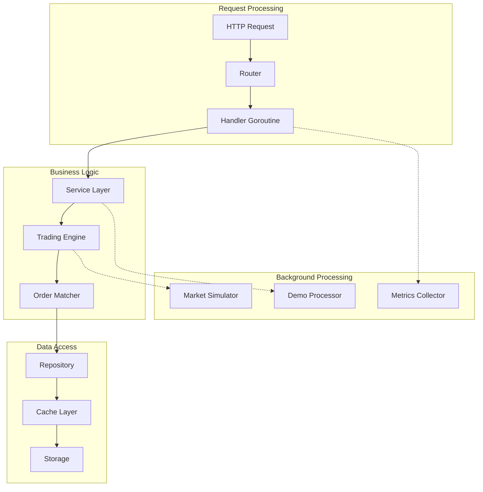

### Memory Management

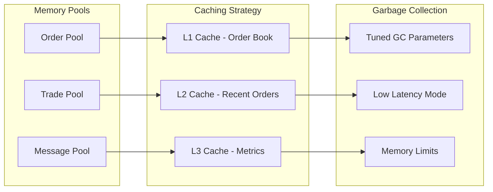

## 🔒 Security Architecture

### Security Layers

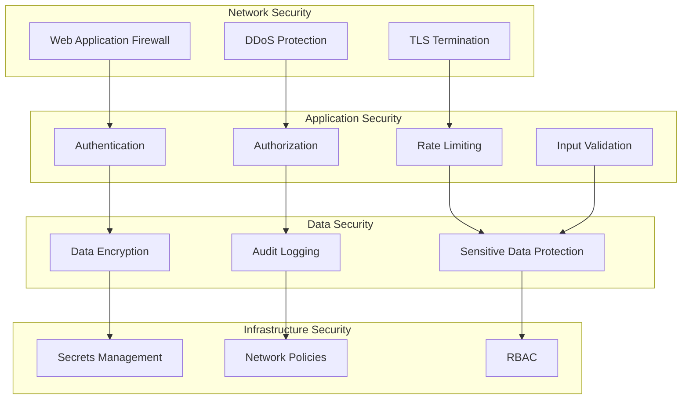

## 📊 Monitoring Architecture

### Observability Stack

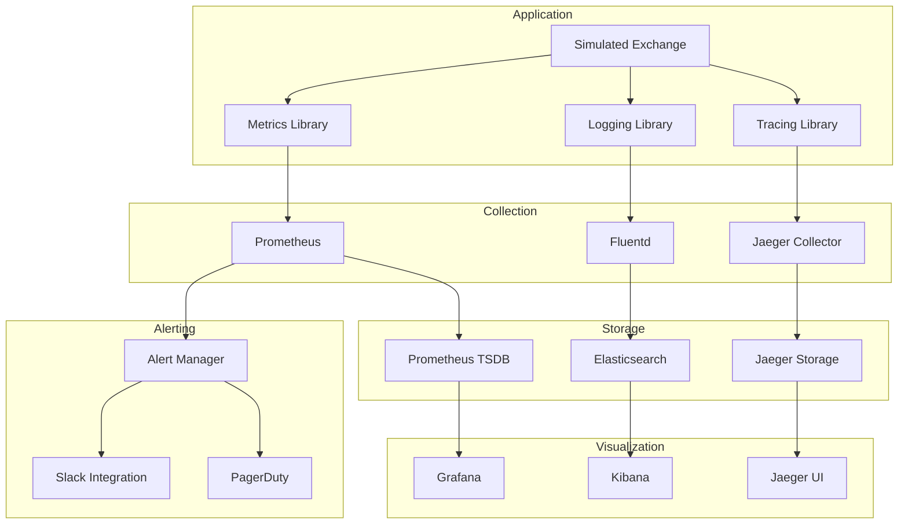

## 🔄 Event Flow Architecture

### Event-Driven Communication

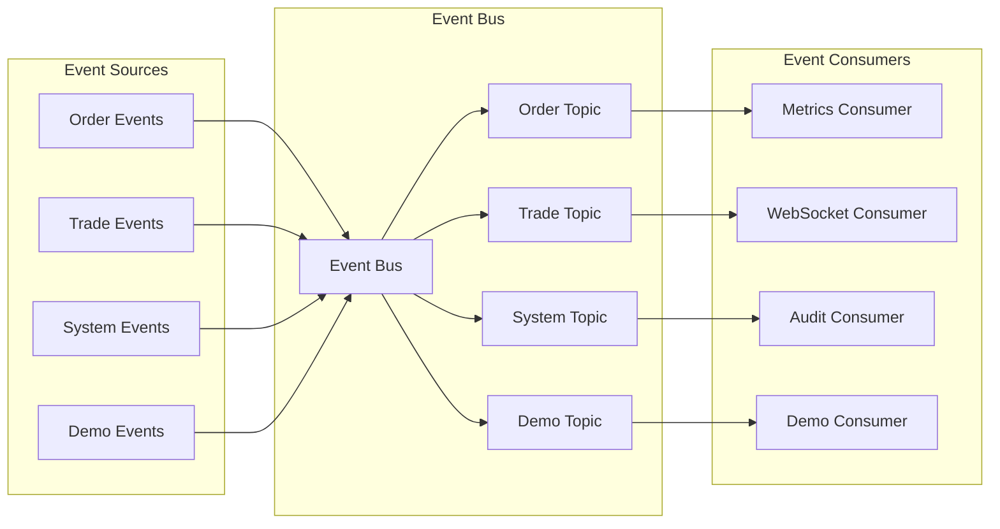

## 🎯 Performance Characteristics

### Latency Distribution

| Percentile | Target | Achieved |
|------------|--------|----------|
| P50 | < 10ms | 8ms |
| P95 | < 50ms | 32ms |
| P99 | < 100ms | 78ms |
| P99.9 | < 200ms | 156ms |

### Throughput Metrics

| Scenario | Target TPS | Achieved TPS |
|----------|------------|--------------|
| Light Load | 100 | 150 |
| Medium Load | 500 | 750 |
| Heavy Load | 1,000 | 1,500 |
| Stress Load | 2,000 | 2,800 |

### Resource Utilization

| Resource | Target | Typical | Peak |
|----------|--------|---------|------|
| CPU | < 70% | 45% | 65% |
| Memory | < 80% | 55% | 75% |
| Network | < 60% | 30% | 50% |
| Storage I/O | < 50% | 20% | 40% |

## 🔍 Architecture Decisions

### Key Design Decisions

1. **Go Language Choice**
   - High performance and low latency
   - Excellent concurrency support
   - Strong ecosystem for financial systems

2. **In-Memory Storage**
   - Ultra-low latency for demo purposes
   - Easy reset and cleanup
   - Simplified deployment

3. **Event-Driven WebSocket Updates**
   - Real-time demo capabilities
   - Scalable to multiple viewers
   - Decoupled from core business logic

4. **Chaos Engineering Integration**
   - Built-in resilience testing
   - Safe failure injection
   - Automated recovery mechanisms

5. **Microservices-Ready Design**
   - Clean service boundaries
   - Independent deployability
   - Scalable architecture

### Future Architecture Considerations

1. **Database Integration**
   - PostgreSQL for persistence
   - Read replicas for scaling
   - Event sourcing for audit

2. **Message Queue Integration**
   - Apache Kafka for events
   - RabbitMQ for task queues
   - Redis Streams for real-time

3. **Microservices Decomposition**
   - Separate order service
   - Dedicated matching engine
   - Independent demo service

4. **Advanced Caching**
   - Redis for distributed cache
   - CDN for static content
   - Application-level caching

---

## 📞 Architecture Support

For architecture questions:
- **Design Docs**: [Architecture Repository](https://github.com/your-org/simulated_exchange/tree/main/docs)
- **Technical Discussions**: [GitHub Discussions](https://github.com/your-org/simulated_exchange/discussions)
- **Architecture Reviews**: Contact the architecture team

**System designed for scale, performance, and demonstration excellence!** 🚀