# Simulated Exchange Platform - Architecture Diagrams

This document contains visual architecture diagrams for the Simulated Exchange Platform using Mermaid syntax. These diagrams can be viewed in GitHub, GitLab, or any markdown viewer that supports Mermaid.

## Table of Contents
1. [System Context Diagram](#system-context-diagram)
2. [High-Level Architecture](#high-level-architecture)
3. [Component Diagram](#component-diagram)
4. [Deployment Diagram](#deployment-diagram)
5. [Order Processing Flow](#order-processing-flow)
6. [Market Simulation Flow](#market-simulation-flow)
7. [Demo Load Test Flow](#demo-load-test-flow)
8. [Chaos Engineering Flow](#chaos-engineering-flow)
9. [Dependency Graph](#dependency-graph)
10. [Data Model Diagram](#data-model-diagram)

---

## System Context Diagram

Shows the system and its interactions with external actors.

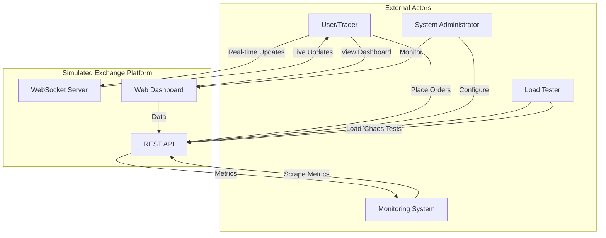

---

## High-Level Architecture

Shows the layered architecture of the system.

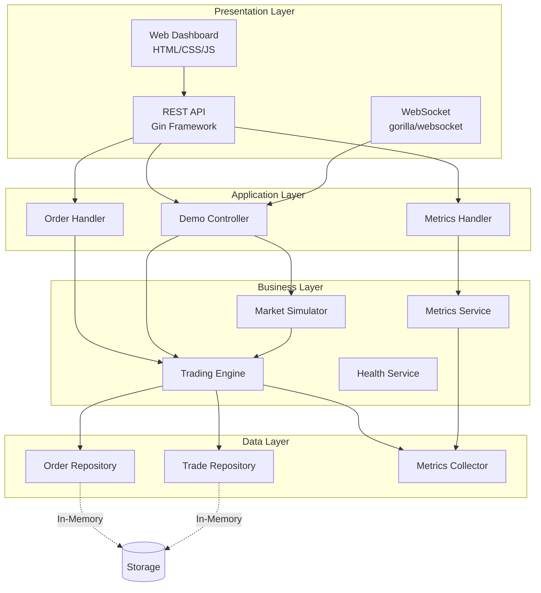

---

## Component Diagram

Detailed view of all system components and their relationships.

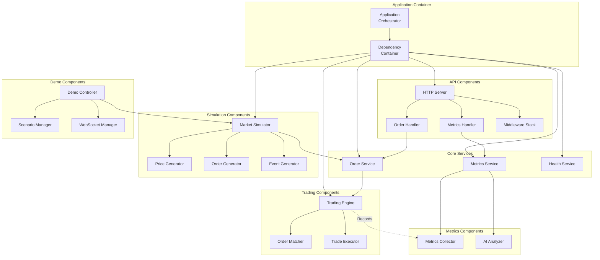

---

## Deployment Diagram

Shows deployment architecture for different environments.

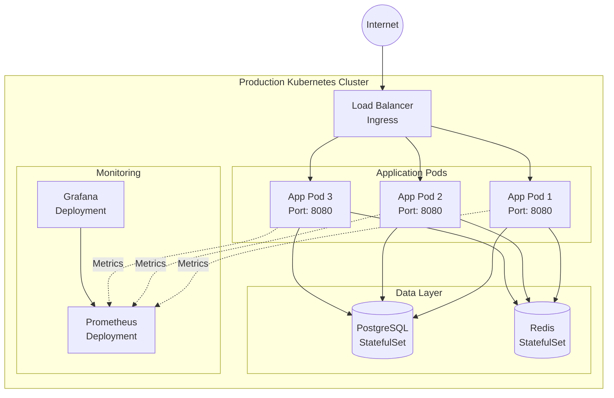

---

## Order Processing Flow

Sequence diagram showing order placement and execution.

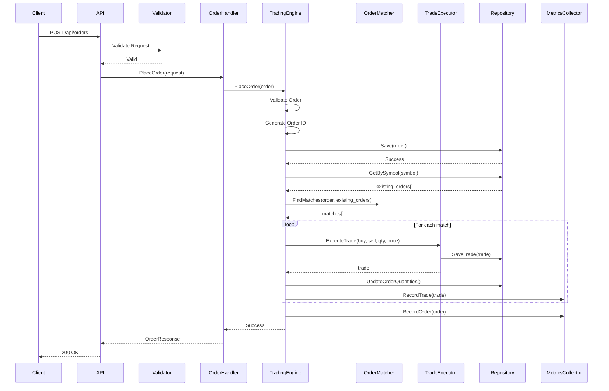

---

## Market Simulation Flow

Shows how market simulation generates and places orders.

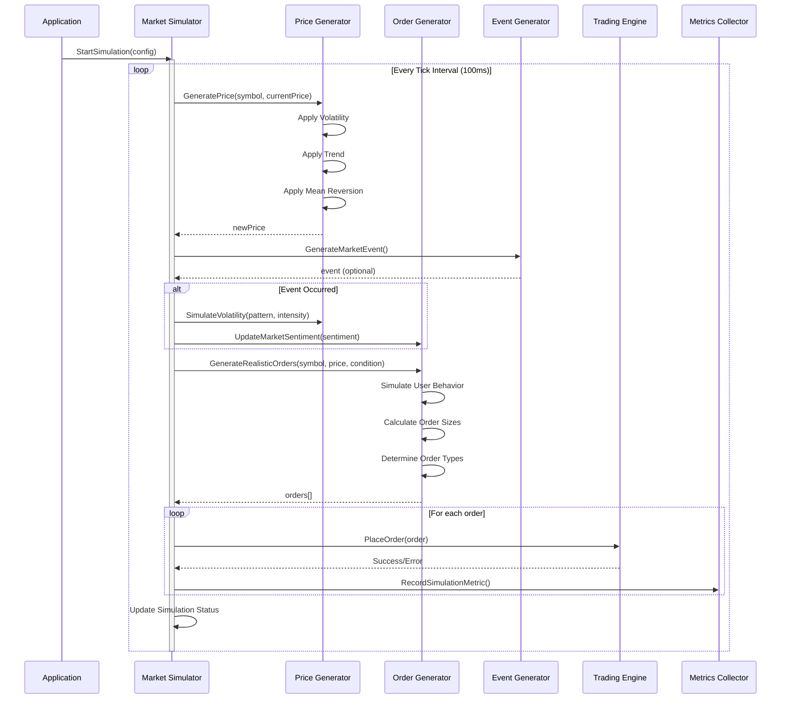

---

## Demo Load Test Flow

Illustrates the load testing execution flow.

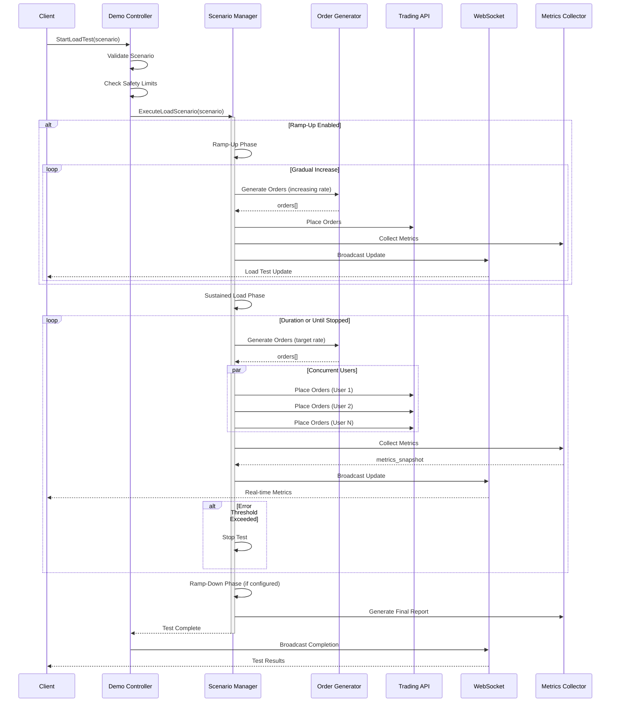

---

## Chaos Engineering Flow

Shows chaos testing execution with failure injection and recovery.

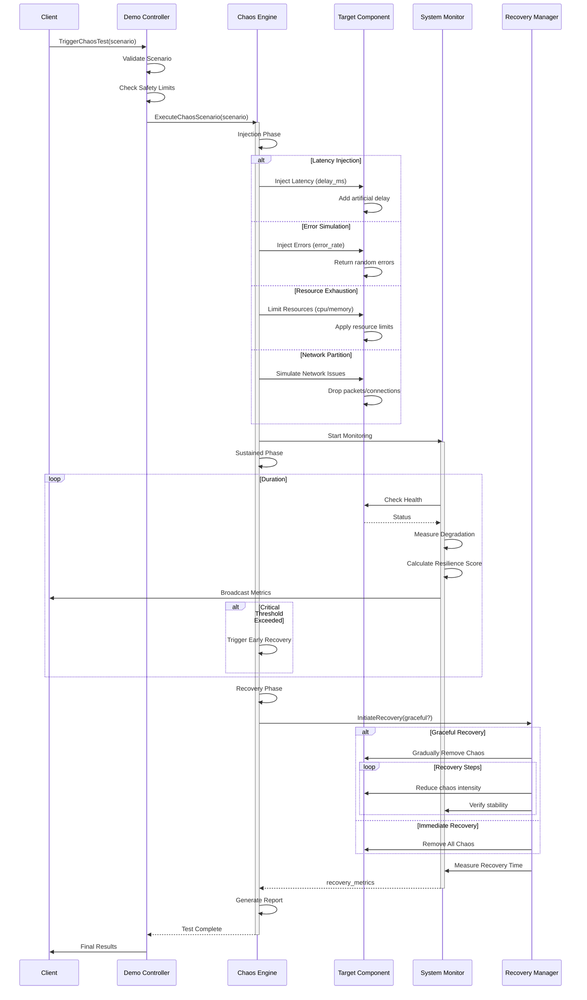

---

## Dependency Graph

Shows the dependency relationships between major components.

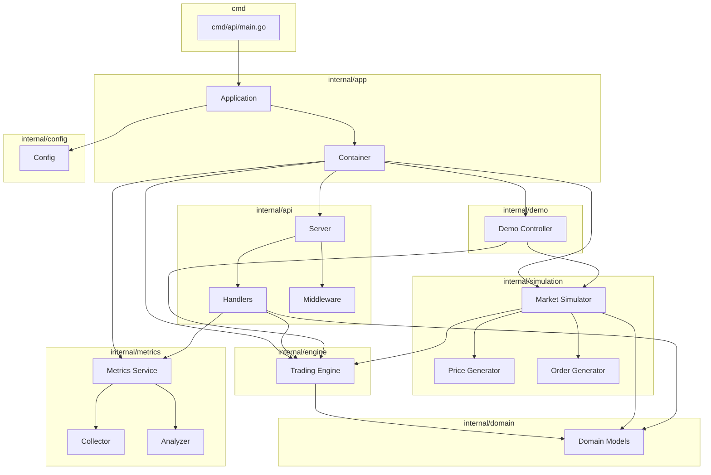

---

## Data Model Diagram

Entity-relationship diagram showing core data models.

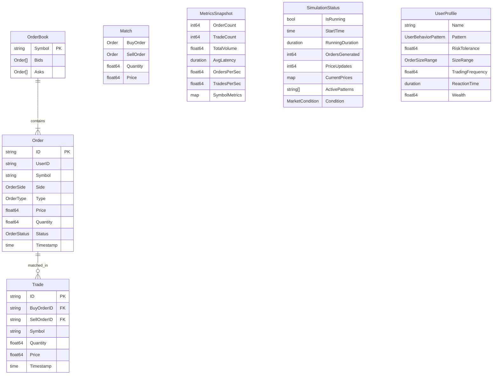

---

## State Machine Diagrams

### Order Status State Machine

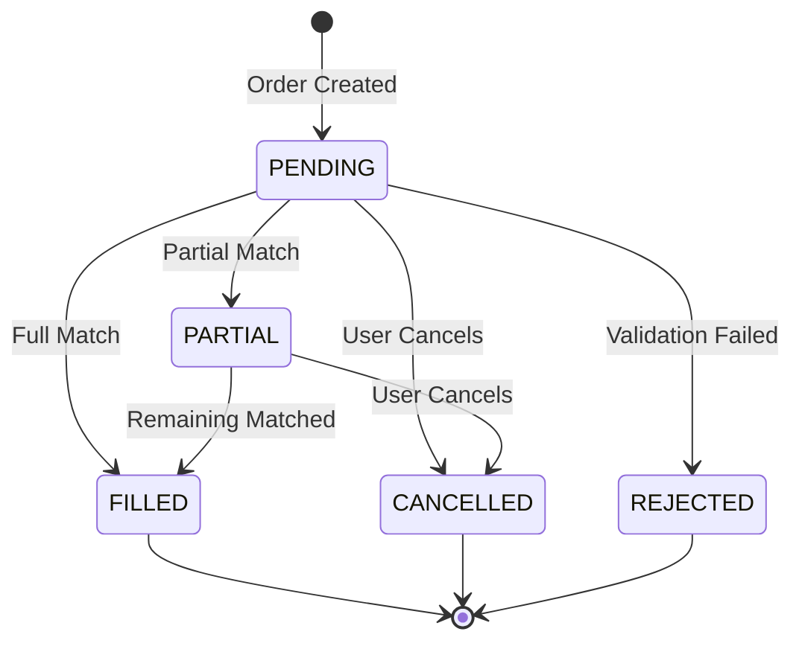

### Simulation State Machine

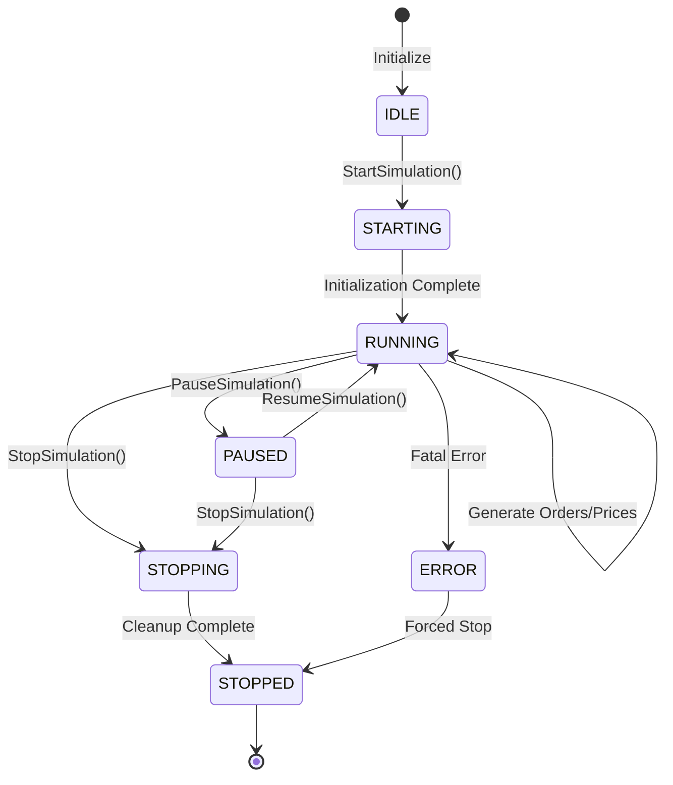

### Load Test State Machine

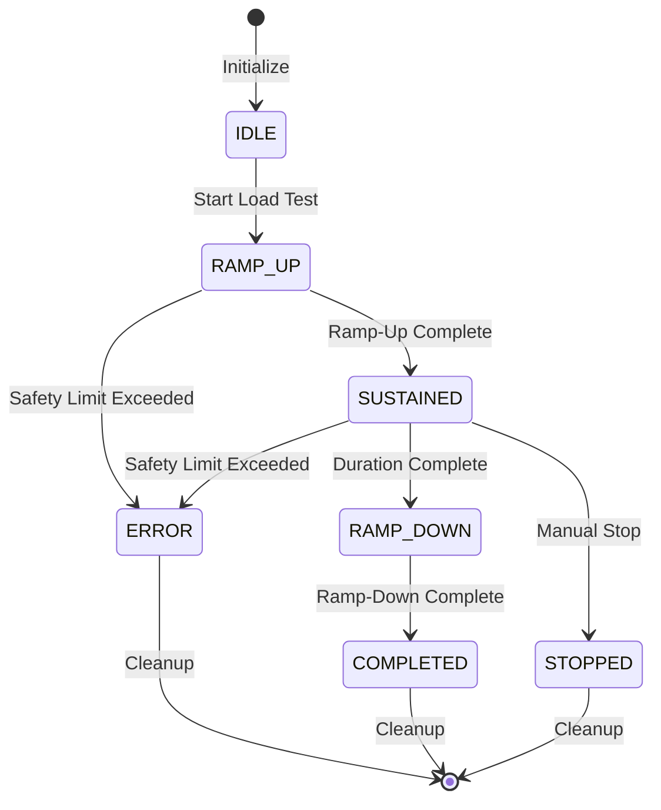

---

## Technology Stack Diagram

Shows the technology layers and their components.

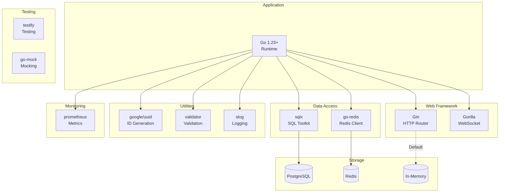

---

## Metrics Collection Architecture

Shows how metrics flow through the system.

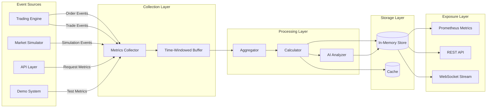

---

## Middleware Pipeline

Shows the HTTP request processing pipeline.

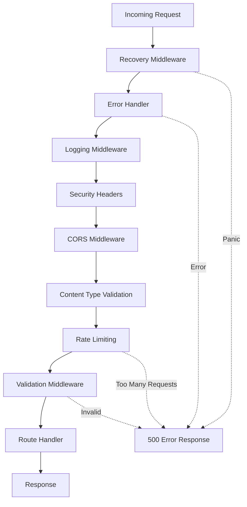

---

**Document Version**: 1.0
**Last Updated**: 2025-10-24
**Format**: Mermaid Diagrams
**Compatible With**: GitHub, GitLab, VS Code (with Mermaid plugin)

## Viewing These Diagrams

### GitHub/GitLab
These diagrams will render automatically when viewing this file on GitHub or GitLab.

### VS Code
Install the "Markdown Preview Mermaid Support" extension.

### Standalone
Use the Mermaid Live Editor: https://mermaid.live/

### Export
You can export these diagrams to PNG/SVG using:
- Mermaid CLI
- Mermaid Live Editor
- VS Code extensions
